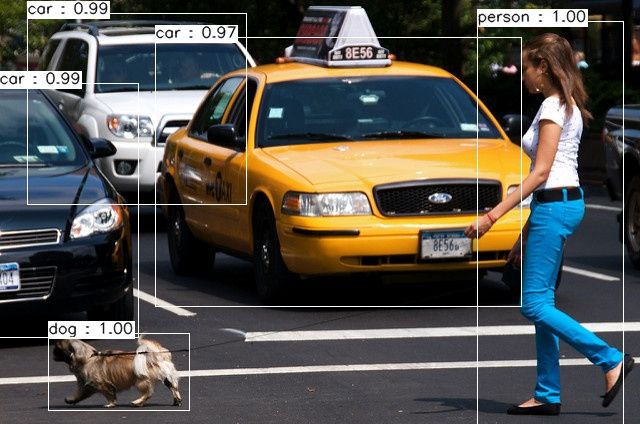

# OpenCV----YOLOv3目标检测推理
this is image soure folder
题目要求：了解opencv的DNN库，给定一张自然场景图片，使用训练好的yolov3模型，进行目标检测结果输出。


 > 分析：
 > 
 > 1）opencv的DNN模块集成了很多深度学习模型，包括人脸检测、图像分类、分割、目标检测等，集成了Pytorch、tensorflow、paddlepaddle等模型框架（参看代码库[OpenCV/dnn](https://github.com/opencv/opencv/tree/master/samples/dnn)）
 > 
 > 2）深度学习推理模型一般步骤：加载模型，包括配置文件和权重文件；输入图像预处理，转换成模型可接受的文件类型和尺寸；模型预测后处理，对于目标检测，主要是NMS后处理方法；

 - 结果展示：

```bash
./bin/yolov3Predict -h
#######
Usage: yolov3Predict [params] image confThreshold nmsThresshold 

        -?, -h, --help, --usage (value:true)
                opecv based deep learining demo

        image
                Image to process
        confThreshold (value:0.5)
                confidence threshold, default 0.5
        nmsThresshold (value:0.3)
                nms threshold, default 0.3
```

```bash
 ./bin/yolov3Predict data/test.jpg
```



 - 代码示例：

yolov3Predict.cpp

```cpp
//yolov3Predict.cpp
/*
@File          :yolov3Predict.cpp
@Description:  :
@Date          :2022/1/9 20:02:10
@Author        :
@version       :1.0
*/
#include<iostream>
#include<string>
#include<sstream>
#include<fstream>
#include<vector>
using namespace std;

#include<opencv2/highgui.hpp>
#include<opencv2/core.hpp>
#include<opencv2/imgproc.hpp>
#include<opencv2/dnn.hpp>

using namespace cv;
using namespace dnn;

#include"utils.hpp"

// define command parse
bool parseParam(int argc, char** argv, const char* keys, Mat& img, float& confThreshold, float& nmsThresshold){
    /*
    @description  : command parse function
    @param  : 
        int argc : main argc
        char** argv: main argv
        keys : command parse keys
        img : the image to read
        confThreshold : confidence threshold setting
        nmsThresshold : nms threshold setting
    @Returns  : 
        (ref returns)
    */
    CommandLineParser parser(argc, argv, keys);
    if(parser.has("help")){
        parser.printMessage();
        return false;
    }
    // check commoand format
    if(!parser.check()){
        parser.printErrors();
        return false;
    }
    // get image
    String imgFile = parser.get<String>(0);
    img = imread(imgFile);
    if(img.empty()){
        cout << "error to load test image. " << endl;
        return false;
    }
    // get confidence threshold
    confThreshold = parser.get<float>(1);
    // get nms threshold
    nmsThresshold = parser.get<float>(2);
    return true;
}

int main(int argc, char** argv){
    const char* keys  = {
        "{help h usage ? | | opecv based deep learining demo}"
        "{@image | | Image to process}"
        "{@confThreshold | 0.5 | confidence threshold, default 0.5}"
        "{@nmsThresshold | 0.3 | nms threshold, default 0.3}"};
    Mat img, blob;
    float confThreshold, nmsThresshold;
    // update data
    if(!parseParam(argc, argv, keys, img, confThreshold, nmsThresshold)){
        return 0;
    }

    // load model
    string classFile = "model/coco.names";
    ifstream fin(classFile.c_str());
    string line;
    vector<string> classes;
    while(getline(fin, line)){
        classes.push_back(line);
    }
    string modelCfg = "model/yolov3.cfg";
    string modelWeg = "model/yolov3.weights";
    Net yolov3 = readNetFromDarknet(modelCfg, modelWeg);
    yolov3.setPreferableBackend(DNN_BACKEND_OPENCV);
    yolov3.setPreferableTarget(DNN_TARGET_CPU);

    // convert image to blob format
    blobFromImage(img, blob, 1/255.0, Size(416, 416), Scalar(0,0,0), true, false);
    yolov3.setInput(blob);
    vector<Mat> outputs;
    // model predict
    yolov3.forward(outputs, getoutputsName(yolov3));
    // post process (nms)
    postProcess(img, outputs, classes, confThreshold, nmsThresshold);
    
    // time cost
    vector<double> layersTime;
    double freq = getTickFrequency() / 1000;
    double t = yolov3.getPerfProfile(layersTime) / freq;
    string label = format("time consuming: %.2f", t);
    cout << label << endl;
    imshow("input", img);
    imwrite("output.jpg", img);
    waitKey(0);
    return 0;
}
```

utils.cpp

```cpp
/*
@File          :utils.cpp
@Description:  :
@Date          :2022/1/9 20:11:10
@Author        :
@version       :1.0
*/
#include<string>
#include<cmath>
#include<memory>
#include<iostream>
using namespace std;

#include<opencv2/core/utility.hpp>
#include<opencv2/highgui.hpp>
#include<opencv2/imgproc.hpp>
#include<opencv2/core.hpp>
#include<opencv2/dnn.hpp>

using namespace cv;
using namespace dnn;

#include"utils.hpp"

Scalar randColor(RNG& rng){
    /*
    @description  : generate randow color
    @param  : 
        rng : random number generator object
    @Returns  : 
        Sacalar() : BGR scalar
    */
    auto iColor = (unsigned)rng;
    return Scalar(iColor&255, (iColor >> 8)&255, (iColor >> 16)&255);
}

// get model output name
vector<string> getoutputsName(Net& net){
    /*
    @description  : get model outputs name
    @param  : 
        Net : deep learning model
    @Returns  : 
        names : model output names
    */
    static vector<string> names;
    if(names.empty()){
        // get output layer idx
        vector<int> outLayers = net.getUnconnectedOutLayers();
        // get all namenames
        vector<string> layersName = net.getLayerNames();
        names.resize(outLayers.size());
        for(size_t i = 0; i < outLayers.size(); i++){
            names[i] = layersName[outLayers[i] - 1];
        }
    }
    return names;
}

// draw prdict result on image
void drawPred(vector<string> classes, int classId, float conf, int left, int top, int right, int bottom, Mat& frame){
    /*
    @description  : drop boxes and confidence on frame
    @param  : 
        classes : the total classes list
        classId : the predicted class id
        conf : predicted confidence
        left : left location
        top : top locatioin
        right : right location
        bottom : bottom location
        frame : the image to draw
    @Returns  : 
        (ref return)
    */
    // draw rectanle for object detected
    rectangle(frame, Point(left, top), Point(right, bottom), Scalar(255, 255, 255), 1);
    // set rectangle for label show
    string conf_label = format("%.2f", conf);
    string label = "";
    if(!classes.empty()){
        label = classes[classId] + " : " + conf_label;
    }
    int baseLine;
    Size labelSize = getTextSize(label, FONT_HERSHEY_SIMPLEX, 0.5, 1, &baseLine);
    top = max(top, labelSize.height);
    rectangle(frame, Point(left, top - labelSize.height), Point(left + labelSize.width, top+baseLine), Scalar(255, 255, 255), FILLED);
    // put label text on image
    putText(frame, label, Point(left, top), FONT_HERSHEY_SIMPLEX, 0.5, Scalar(0, 0, 0), 1, LINE_AA);
}


// post process (NMS) for object detection
void postProcess(Mat& frame, vector<Mat>& outs, vector<string> classes, float confThreshold, float nmsThresshold){
    /*
    @description  : post process predict result to get suitable box to display
    @param  : 
        frame : image to process and return
        outs : predicts result
        classes : the total classes list
        confThreshold : confidence threshold setting
        nmsThresshold : nms threshold setting
    @Returns  : 
        (ref return)
    */
    // get classId, confidence and boxes
    vector<int> classIds;
    vector<float> confs;
    vector<Rect> boxes;
    for(size_t i = 0; i < outs.size(); i++){
        float* data = (float*) outs[i].data;
        for(int j = 0; j < outs[i].rows; j++, data += outs[i].cols){
            // get socres for detectd class and scores
            Mat scores = outs[i].row(j).colRange(5, outs[i].cols);
            Point classIdPoint;
            double conf;
            // get min max value in socores with idx
            minMaxLoc(scores, 0, &conf, 0, &classIdPoint);
            // filter too small confidence
            if(conf > confThreshold){
                int x = (int) (data[0]*frame.cols);
                int y = (int) (data[1]*frame.rows);
                int w = (int) (data[2]*frame.cols);
                int h = (int) (data[3]*frame.rows);
                int left = x - w / 2;
                int top = y - h / 2;
                classIds.push_back(classIdPoint.x);
                confs.push_back((float)conf);
                boxes.push_back(Rect(left, top, w, h));

            }
        }
    }
    // NMS operation
    vector<int> idxs;
    NMSBoxes(boxes, confs, confThreshold, nmsThresshold, idxs);
    for(size_t i = 0; i < idxs.size(); i++){
        int idx = idxs[i];
        Rect box = boxes[idx];
        drawPred(classes, classIds[idx], confs[idx], box.x, box.y, box.x+box.width, box.y+box.height, frame);
    }
}

```
